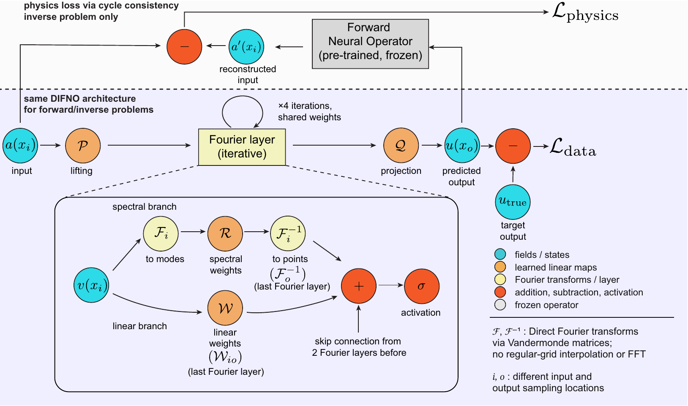

# DIFNO / PI-DIFNO: sea-level fingerprints to ice-loss patterns

DIFNO is a Fourier neural operator that works on scattered points instead of a regular
grid: the truncated Fourier transform is evaluated directly with precomputed Vandermonde
matrices (direct spectral evaluation), so no FFT and no regridding is needed. The forward
and inverse transforms may use different point clouds, so input and output domains can be
mismatched, here Greenland ice-thickness change on one point set and sea-surface height
(SSH) at scattered altimetry points on another. A single spectral layer with tied weights
is iterated four times (the "iterative" part). PI-DIFNO adds physics: the inverse operator
is trained with a cycle-consistency loss that pushes its predicted ice field back through
a frozen forward surrogate and compares it with the input SSH.



*Architecture of DIFNO and the physics (cycle-consistency) loss used for the inverse problem. Vector version: [docs/FNO_wphysics_fine.pdf](docs/FNO_wphysics_fine.pdf).*

## The four trained operators

Errors are per-sample relative L1, `mean(|pred - truth|) / mean(|truth|) x 100`, on the
held-out test split. Cycle error compares the input SSH with the frozen forward surrogate
applied to the predicted ice.
Overall value first, per-family values in parentheses in the order of the training-data
column.

| Model | Map | Training data | Params | Method | Test rel-L1 (%) | Cycle rel-L1 (%) |
|---|---|---|---:|---|---|---|
| Default forward | ice -> SSH | single + multi | 21,950,313 | plain L1 | 0.24 (0.23 / 0.25) | n/a |
| Coastal forward | ice -> SSH | single + multi + coastal | 21,950,313 | plain L1 | 0.35 (0.33 / 0.43 / 0.29) | n/a |
| Default inverse | SSH -> ice | single + multi | 21,949,597 | L1 + cycle L1, PCGrad | 30.1 (21.8 / 38.3) | 0.68 (0.69 / 0.68) |
| Coastal inverse | SSH -> ice | coastal | 21,949,597 | amplitude-weighted L1 + cycle, CAGrad (c = 0.2) | 33.0 | 3.05 |

All four share the same backbone: 20 x 20 Fourier modes, width 32, Adam at lr 1e-3 with
weight decay 1e-4 and `StepLR(step 100, gamma 0.1)`.

## Layout

```
src/                 importable modules factored out of the training notebooks
  models.py          VFT (Vandermonde transform), SpectralConv2d_dse, FNO_dse
  losses.py          AmplitudeWeightedLoss
  grad_surgery.py    PCGrad and CAGrad
  utilities.py       count_params, percentage_difference, print_params_by_module
  adam.py            complex-capable Adam
  device.py          cuda -> mps -> cpu selection
01_train_forward.ipynb   default forward (section 1) and coastal forward (section 2)
02_train_inverse.ipynb   default inverse / PCGrad (1) and coastal inverse / CAGrad (2)
docs/                    architecture schematic (PNG for this page, PDF vector)
```

## Running

Run the notebooks from this directory, so that `from src import ...` resolves
(`jupyter lab 01_train_forward.ipynb`). The cell outputs already in the notebooks are the
**original training records** from the cluster runs; nothing was re-executed for this
release. To retrain, put the ensemble tensors under `data/` and the frozen forward
checkpoints under `_Models/`, the paths the `configs['datapath']` and `torch.load` lines
expect.

**Data and checkpoints are not included here.** The ensembles, point coordinates and the
trained `.pt` checkpoints will be uploaded separately by the author.

## Requirements

Listed in `requirements.txt` (`pip install -r requirements.txt`): `torch` (>= 2.0), `numpy` (1.x),
`scipy` (CAGrad's line search), `matplotlib`, `jupyter`. Python 3.10 or newer.
`src.device.get_device()` picks CUDA, then Apple MPS, then CPU; override with
`DIFNO_DEVICE`. Training used one CUDA GPU (about 100 min per forward run). On Apple
silicon the spectral layer evaluates the complex product as a real-decomposed
contraction (a workaround for a PyTorch MPS bug in the complex-einsum backward, plus
materialisation of conjugated complex views), so training on MPS gives the same results
as CUDA/CPU up to float precision; the CUDA and CPU code paths are unchanged.
This was verified with a CPU vs MPS consistency check (same seed, same input, comparing forward outputs and every parameter
gradient after a backward pass), which agrees to about 1e-6 relative; that check is a
development script and is not shipped with this snapshot.

## Citation

If you use this code, please cite:

> X. Bao, S. Coulson, N. Valencic, S. M. Mousavi, S. Dangendorf, A. J. Lloyd, and
> J. X. Mitrovica, *Neural Operators Reveal Scale-Dependent Limits on Recovering
> Greenland Ice Loss from Sea-Level Fingerprints*, submitted.

## Acknowledgment

This code is modified from the DSE (direct spectral evaluation) reference implementation:

> L. E. Lingsch, M. Y. Michelis, E. de Bezenac, S. M. Perera, R. K. Katzschmann,
> S. Mishra, *Beyond Regular Grids: Fourier-Based Neural Operators on Arbitrary Domains*,
> ICML 2024. arXiv:2305.19663.
> Code: https://github.com/camlab-ethz/DSE-for-NeuralOperators

`src/adam.py` and the two helpers in `src/utilities.py` are taken from that repository's
`_Utilities/`; its Adam in turn comes from
https://github.com/neuraloperator/neuraloperator (Li et al., FNO). The gradient-surgery
methods are PCGrad (Yu et al. 2020) and CAGrad (Liu et al. 2021).

## License

MIT, see `LICENSE`. The upstream DSE and neuraloperator code is MIT licensed, so this
keeps the derived files compatible.
